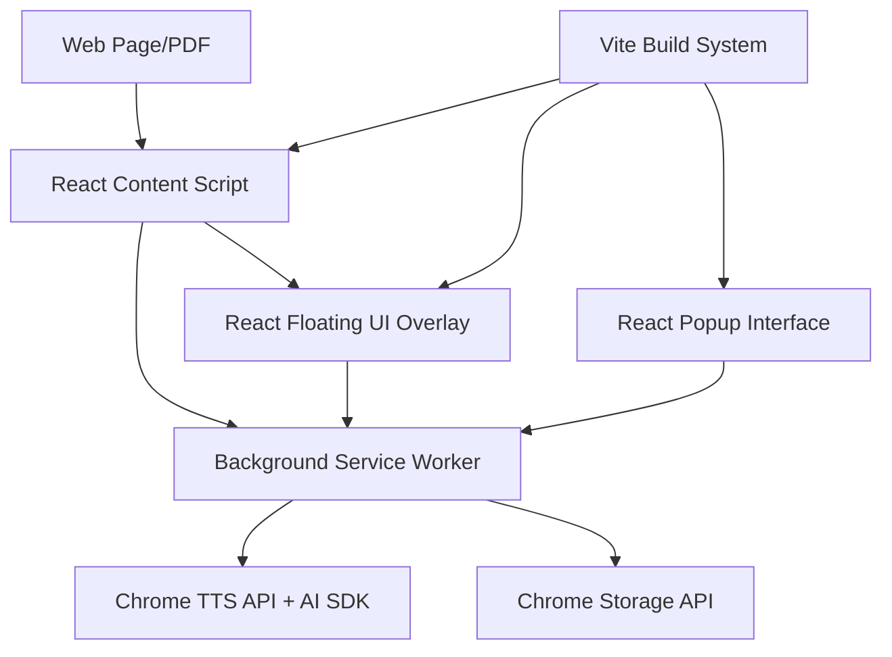

# Kenkan Chrome Extension Design Document

## Overview

Kenkan is a Chrome extension that provides automatic text-to-speech functionality for web content, PDFs, and scanned documents. The extension uses a multi-component architecture with content scripts for text extraction, a background service worker for TTS coordination, and a floating UI overlay for user controls.

## Architecture

### Tech Stack
- **React 18** - Component-based UI framework
- **Vite** - Fast build tool and dev server
- **Tailwind CSS** - Utility-first CSS framework
- **shadcn/ui** - High-quality React components
- **Lucide React** - Beautiful icon library
- **Vercel AI SDK** - For potential AI-enhanced voice features
- **TypeScript** - Type safety and better developer experience

### High-Level Architecture



### Component Overview

1. **React Content Script**: Injected React app for text extraction and UI overlay management
2. **Background Service Worker**: Coordinates TTS playback with AI SDK integration
3. **React Floating UI Overlay**: shadcn/ui components for playback controls
4. **React Popup Interface**: Extension popup built with React and shadcn/ui
5. **Storage Manager**: Handles persistence with TypeScript interfaces

## Components and Interfaces

### React Content Script (`content.tsx`)

**Responsibilities:**
- Extract readable text from HTML, PDF.js, and images (OCR)
- Render React-based floating UI overlay
- Highlight currently spoken text with smooth animations
- Communicate with background service worker

**Key Components:**
```typescript
// Content extraction hook
const useContentExtractor = () => {
  const extractHTMLText = (): string[] => { /* */ }
  const extractPDFText = async (): Promise<string[]> => { /* */ }
  const extractImageText = async (): Promise<string[]> => { /* */ }
  const filterContentText = (elements: Element[]): string[] => { /* */ }
  return { extractHTMLText, extractPDFText, extractImageText, filterContentText }
}

// Main floating overlay component
const FloatingOverlay: React.FC<OverlayProps> = ({ 
  playbackState, 
  onPlayPause, 
  onStop, 
  onSpeedChange 
}) => {
  return (
    <div className="fixed z-50 bg-background border rounded-lg shadow-lg">
      <Button variant="ghost" size="sm" onClick={onPlayPause}>
        {playbackState.isPlaying ? <Pause /> : <Play />}
      </Button>
      {/* shadcn/ui components */}
    </div>
  )
}
```

### Background Service Worker (`background.ts`)

**Responsibilities:**
- Manage TTS playback using chrome.tts API and AI SDK
- Coordinate state across multiple tabs
- Handle storage operations with TypeScript interfaces
- Process messages from React content scripts

**Key Classes:**
```typescript
class TTSManager {
  private aiClient: any // Vercel AI SDK client
  
  async startReading(text: string[], options: TTSOptions): Promise<void>
  pauseReading(): void
  resumeReading(): void
  stopReading(): void
  setVoice(voiceId: string): void
  setSpeed(rate: number): void
  setVolume(volume: number): void
  
  // AI-enhanced features
  async enhanceVoiceQuality(text: string): Promise<string>
  async generateNaturalPauses(text: string): Promise<string>
}

class StateManager {
  saveReadingProgress(tabId: number, position: number): Promise<void>
  getReadingProgress(tabId: number): Promise<number>
  syncTabStates(): Promise<void>
  handleTabSwitch(tabId: number): Promise<void>
}
```

### Floating UI Overlay

**Design Principles:**
- Minimal, non-intrusive design
- Draggable and resizable
- Accessible keyboard navigation
- Responsive to different screen sizes

**Components:**
- Play/Pause/Stop buttons
- Speed control slider (0.5x - 3x)
- Voice selection dropdown
- Volume control
- Progress indicator
- Minimize/close buttons

### Storage Schema

```javascript
// Chrome storage structure
{
  userPreferences: {
    defaultVoice: string,
    defaultSpeed: number,
    defaultVolume: number,
    overlayPosition: { x: number, y: number },
    autoStart: boolean
  },
  readingProgress: {
    [tabId]: {
      url: string,
      position: number,
      timestamp: number,
      textLength: number
    }
  },
  tabStates: {
    [tabId]: {
      isActive: boolean,
      currentText: string[],
      playbackState: 'playing' | 'paused' | 'stopped'
    }
  }
}
```

## Data Models

### Text Content Model
```javascript
interface TextContent {
  id: string;
  source: 'html' | 'pdf' | 'ocr';
  segments: TextSegment[];
  metadata: {
    title: string;
    url: string;
    extractedAt: Date;
    wordCount: number;
  };
}

interface TextSegment {
  text: string;
  element?: HTMLElement;
  position: { start: number; end: number };
  type: 'paragraph' | 'heading' | 'list' | 'other';
}
```

### Playback State Model
```javascript
interface PlaybackState {
  isPlaying: boolean;
  currentSegment: number;
  currentPosition: number;
  totalSegments: number;
  voice: string;
  speed: number;
  volume: number;
}

interface TTSOptions {
  voiceURI: string;
  rate: number;
  pitch: number;
  volume: number;
  lang: string;
}
```

## Error Handling

### TTS Error Handling
- **Voice Unavailable**: Fall back to default system voice
- **TTS API Failure**: Provide user notification and retry mechanism
- **Network Issues**: Cache content locally for offline reading
- **Permission Denied**: Guide user through permission setup

### Content Extraction Errors
- **PDF.js Not Available**: Detect and provide fallback message
- **OCR Service Failure**: Graceful degradation without OCR features
- **Content Blocked**: Inform user about site restrictions
- **Large Document Handling**: Implement chunking and progressive loading

### Storage Errors
- **Quota Exceeded**: Implement LRU cache for reading progress
- **Sync Failures**: Provide local-only mode as fallback
- **Corrupted Data**: Reset to defaults with user notification

## Testing Strategy

### Unit Testing
- Content extraction functions with various HTML structures
- TTS manager state transitions and error handling
- Storage operations and data persistence
- UI overlay positioning and interaction handling

### Integration Testing
- End-to-end reading flow from content detection to speech
- Cross-tab state synchronization
- Chrome API integration (TTS, storage, tabs)
- PDF.js integration with various document types

### Browser Testing
- Chrome version compatibility (Manifest V3)
- Performance testing with large documents
- Memory usage monitoring during extended sessions
- Accessibility testing with screen readers

### Test Scenarios
```javascript
// Example test cases
describe('Content Extraction', () => {
  test('extracts clean text from news articles');
  test('handles PDF documents with embedded text');
  test('filters out navigation and advertisement content');
  test('processes tables and lists appropriately');
});

describe('TTS Playback', () => {
  test('maintains playback across tab switches');
  test('resumes from saved position');
  test('handles voice changes during playback');
  test('manages speed adjustments smoothly');
});
```

## Implementation Phases

### Phase 1: MVP Core Features
- Basic HTML text extraction
- Chrome TTS integration
- Simple floating controls (play/pause/stop)
- Basic storage for preferences

### Phase 2: Enhanced Experience
- PDF.js integration
- Cross-tab state management
- Advanced playback controls (speed, voice selection)
- Progress tracking and resume functionality

### Phase 3: Advanced Features
- OCR integration for scanned documents
- Keyboard shortcuts
- Advanced text filtering and cleanup
- Performance optimizations

### Phase 4: Polish and Extensions
- Custom voice integration options
- User presets and profiles
- Multi-language support
- Analytics and usage insights

## Security and Privacy Considerations

### Data Handling
- No text content sent to external servers
- Local storage only for user preferences
- Minimal permissions requested (activeTab, storage, tts)
- Clear privacy policy regarding data usage

### Content Security
- Respect website Content Security Policies
- Handle cross-origin restrictions gracefully
- Secure communication between components
- Validate all user inputs and stored data

## Performance Considerations

### Memory Management
- Efficient text chunking for large documents
- Cleanup of unused DOM references
- Lazy loading of OCR capabilities
- Progressive content processing

### CPU Optimization
- Debounced text extraction on dynamic content
- Efficient DOM traversal algorithms
- Background processing for non-critical operations
- Minimal impact on page rendering performance